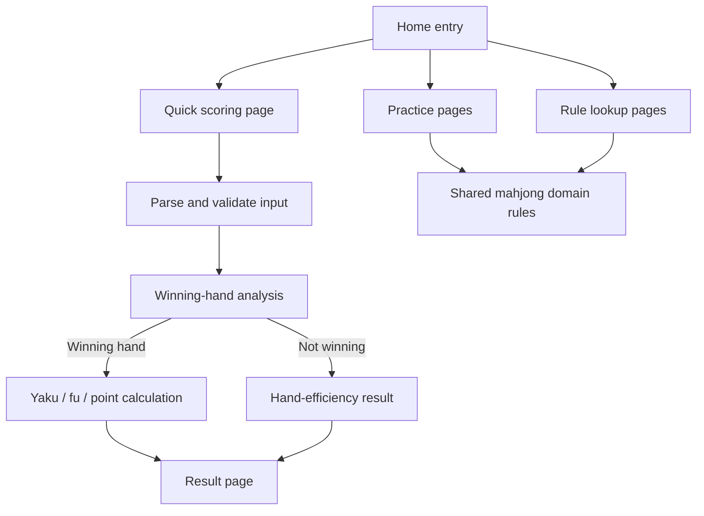

# Technical Design

## Current Project Shape

- Framework: native WeChat mini-program built with `weapp-vite`.
- Source root: `src`.
- Current app routes: `pages/index/index` and `pages/layouts/index`.
- Current implementation is still a template, so the product work can define clean feature folders without needing a migration from existing product code.

## Design Principles

- Keep scoring rules in pure TypeScript domain modules, independent of page state.
- Keep WeChat page code focused on input state, validation messages, navigation, and rendering domain results.
- Treat screenshots as functional evidence only; do not copy ad content or visual styling.
- Use `docs/pencil-html/` and `docs/pencil-exports-local/` as frontend references for page hierarchy, control patterns, interaction states, and copy direction.
- Do not let Pencil-only concepts expand MVP scope unless the PRD explicitly includes them.
- Build rules and lookup tables from shared data so quick scoring, practice modules, and help pages do not drift.
- Make unsupported or entry-only modules explicit instead of inventing behavior.

## Frontend Reference Assets

- Functional evidence: `.trellis/tasks/07-01-riichi-mahjong-tool-miniapp/screenshot-analysis.md`
- Frontend reference summary: `.trellis/tasks/07-01-riichi-mahjong-tool-miniapp/frontend-reference-analysis.md`
- Raw frontend exports:
  - `docs/pencil-html/`
  - `docs/pencil-exports-local/`

Implementation should use the Pencil exports for:

- home grouping and entry naming;
- tile keyboard interactions;
- quick scoring state and result presentation;
- practice answer feedback panels;
- han/fu calculator and quick lookup table structure;
- yaku list/detail structure;
- help page table patterns;
- contact/feedback and under-construction placeholder states.

The references are not pixel-perfect requirements. The implementation should remain a native WeChat mini-program that follows existing `weapp-vite` project conventions.

## Proposed Source Boundaries

```text
src/
  app.json
  pages/
    index/
    score-quick/
    score-result/
    practice-chinitu-waits/
    practice-fu/
    practice-points/
    practice-comeback/
    lookup-han-fu-calculator/
    lookup-han-fu-table/
    yaku-list/
    yaku-detail/
    help-fu/
    help-points/
    contact/
    hand-recognition-placeholder/
    placeholder/
  components/
    MahjongTiles/
    HanFuSelector/
    PracticeAnswerPanel/
    WindSelector/
    YakuConditionSelector/
  domain/
    mahjong/
      tiles.ts
      selection.ts
      validation.ts
      hand-shape.ts
      yaku.ts
      fu.ts
      points.ts
      sanma.ts
      efficiency.ts
      practice.ts
      lookup-data.ts
  data/
    yaku.ts
    help-fu.ts
    help-points.ts
```

The exact file names can change during implementation, but the separation should remain:

- `domain/mahjong/**` owns rule math and reusable contracts.
- `data/**` owns static content and point/yaku reference data.
- `pages/**` owns route-level behavior.
- `components/**` owns repeated interaction elements.

## Core Contracts

### Tile Model

- Represent tiles with suit, rank, and optional red-dora flag.
- Support manzu, pinzu, souzu, honors.
- Support red fives for quick scoring in manzu, pinzu, and souzu. Red fives are distinct selections in UI state but count as the same physical rank for tile-count validation.
- Support three-player north-dora count separately from physical hand tiles because screenshots show a `拔北宝牌数` numeric selector.
- MVP tile entry uses a bottom-sheet tile keyboard rather than text input.
- Tile keyboard state should track the ordered selected tiles, because the last hand tile is treated as the winning tile.

### Scoring Input

```ts
type ScoreMode = 'yonma' | 'sanma'
type WinMethod = 'ron' | 'tsumo'
type Wind = 'east' | 'south' | 'west' | 'north'
type MeldKind = 'chi' | 'pon' | 'openKan' | 'closedKan' | 'addedKan'

interface ScoreInput {
  mode: ScoreMode
  handTiles: Tile[]
  melds: Array<{ kind: MeldKind; tiles: Tile[] }>
  doraIndicators: Tile[]
  uraDoraIndicators: Tile[]
  northDoraCount: 0 | 1 | 2 | 3 | 4
  roundWind: Wind
  seatWind: Wind
  honba: number
  doubleWindPairTwoFu: boolean
  conditions: {
    doubleRiichi: boolean
    riichi: boolean
    ippatsu: boolean
    rinshan: boolean
    tsumo: boolean
    haiteiOrHoutei: boolean
    chankan: boolean
    tenhou: boolean
    chiihou: boolean
  }
}
```

Text hand input is out of MVP scope. Page code should convert bottom-sheet keyboard selections into these typed tile arrays and meld objects before validation.

### Scoring Result

```ts
interface ScoreResult {
  mode: ScoreMode
  valid: boolean
  yaku: Array<{ id: string; name: string; han: number | 'yakuman'; source: 'hand' | 'condition' | 'dora' }>
  han: number
  fu?: number
  limit?: 'mangan' | 'haneman' | 'baiman' | 'sanbaiman' | 'yakuman'
  payments?: {
    ron?: number
    tsumoDealerPays?: number
    tsumoNonDealerPays?: number
  }
  warnings: string[]
}
```

If the input cannot form a winning hand, return a hand-efficiency result instead of a scoring result.

```ts
interface EfficiencyResult {
  mode: ScoreMode
  shanten: number
  effectiveTiles: Array<{ tile: Tile; remainingCount: number }>
  totalEffectiveTileCount: number
  warnings: string[]
}
```

MVP should expose only the shanten number, effective tile list, and total effective tile count. Pattern-specific branches such as normal hand, chiitoitsu, and kokushi may exist internally, but should not be surfaced as first-version user-facing detail.

## Rule Engine Design

### Tile Selection And Validation

- Convert hand, meld, dora, and ura-dora keyboard selections into typed tile arrays and meld objects.
- Validate total tile counts, duplicate physical tile counts including red-five/non-red-five combined limits, winning tile position, meld counts, and mode-specific constraints.
- Validate impossible condition combinations, such as tenhou/chiihou conflicts or tsumo/ron-specific yaku conflicts.

### Hand Shape

- Support standard four-sets-and-pair decomposition.
- Support chiitoitsu.
- Support kokushi musou if quick scoring scope includes it.
- Return all valid decompositions so fu/yaku/point tie-break rules can be applied.

### Yaku

- Separate yaku detected from tiles from yaku supplied by user conditions.
- Dora and ura-dora are not yaku but contribute han after yaku existence is established.
- Red dora are counted as dora han in quick scoring. Practice generation still excludes red dora unless a future scope decision changes that.
- Main scoring should cover modern standard riichi yaku and common yakuman needed for normal scoring.
- Local yaku and old-yaku rules stay outside the main scoring engine in MVP.

### Fu

- Implement standard fu components:
  - base fu;
  - menzen ron;
  - tsumo;
  - wait fu;
  - triplet/quad fu;
  - pair fu;
  - double-wind pair policy;
  - rounding.
- Match screenshot-confirmed practice rules:
  - chiitoitsu is 25 fu;
  - kokushi musou is treated as fixed 25 fu for the tool where applicable;
  - generated fu-practice hands exclude chiitoitsu and kokushi musou.

### Points

- Centralize point-table calculation and/or validated lookup tables.
- Expose a single API for:
  - quick scoring results;
  - han/fu calculator;
  - han/fu quick lookup;
  - point practice checking;
  - comeback practice checking.
- Support dealer/non-dealer, ron/tsumo, and limit classes.
- Honba is required by quick scoring but excluded from point-practice answers per screenshot evidence.
- Kyoutaku / riichi-stick deposit settlement is out of MVP scope by user decision. Riichi and double-riichi still remain yaku conditions.

### Sanma

- Support sanma quick scoring with north-dora count.
- Disallow chi in sanma validation.
- Use common Japanese sanma tsumo-loss settlement for MVP.
- Surface a clear rule warning when users calculate in sanma mode.

## Practice Engine Design

### Shared Practice State

- Each practice mode tracks:
  - current question;
  - user answer;
  - correct answer;
  - correct streak;
  - feedback state.
- Practice feedback should show correctness, standard answer, user answer, and a short breakdown when available.
- Wrong-answer ad gating is out of MVP scope; practice should be unrestricted.

### Chinitu Wait Practice

- Generate single-suit hands requiring wait identification.
- Candidate answers are tile ranks 1 through 9 in the same suit.
- Correct answer is the set of waits.

### Fu Practice

- Generate valid winning hands with visible round wind, seat wind, and win method.
- Include haitei/houtei role as described in screenshots to avoid no-yaku generated hands.
- Exclude chiitoitsu and kokushi musou from question generation.
- Answer options are fixed fu values from 20 to 170.

### Point Practice

- Generate random winning hands, including possible no-yaku cases.
- Default to four-player mode.
- Exclude red dora and invisible yaku unless explicitly declared by the question.
- Ask for total acquired points and allow `0` for no-yaku.
- Provide embedded han/fu lookup table.

### Comeback Practice

- Generate scenario:
  - user seat wind;
  - target player seat wind;
  - point gap;
  - ron against target player.
- Ask minimum fu or impossible for each shown han tier.
- Reuse point calculation for correctness.

## Pages And Navigation

- `pages/index/index`: replace template with functional entry navigation.
- `pages/score-quick/index`: quick scoring input using bottom-sheet tile keyboard entry.
- `pages/score-result/index`: scoring or hand-efficiency result.
- `pages/practice-*`: separate practice modes to keep state and validation simple.
- `pages/help-*`: static help text backed by data files.
- `pages/lookup-*`: han/fu calculator and quick table.
- `pages/yaku-*`: yaku list and detail.
- `pages/placeholder/index`: entry-only modules such as chat scoring, old-yaku scoring, and table-score records if they are exposed before being specified.
- `pages/hand-recognition-placeholder/index`: optional placeholder for Pencil-only physical hand recognition reference, not MVP functionality.
- Use `frontend-reference-analysis.md` to map Pencil exports to each page before implementing the corresponding page.

Update `src/app.json` routes when pages are created.

## Data Flow



## Compatibility And Migration

- The current project is a template, so route changes can be broad as long as `src/app.json` stays valid.
- Use project scripts first:
  - `pnpm build` for verification;
  - `pnpm lint` and `pnpm stylelint` when code volume justifies it;
  - `pnpm dev` or `pnpm open` for runtime checks;
  - `wv screenshot` for WeChat DevTools acceptance screenshots once pages exist.
- Keep `.weapp-vite/` generated support files under tool ownership; run `wv prepare` only when needed.

## Risks And Trade-offs

- Riichi scoring is rule-heavy; domain tests are mandatory before trusting UI behavior.
- Tile keyboard implementation is broader than a text field, but it is the chosen MVP input path and should reduce user input errors.
- Full yaku coverage is large. MVP should define whether it needs only screenshot-visible yaku or a complete standard yaku set.
- Practice generation must avoid impossible or ambiguous questions unless the ambiguity is intentionally explained.
- Chat-style scoring and old-yaku scoring are visible entries but not specified features; implementing them prematurely would invent behavior.
- Table-score records and physical hand recognition also stay placeholder/later-scope in MVP.
